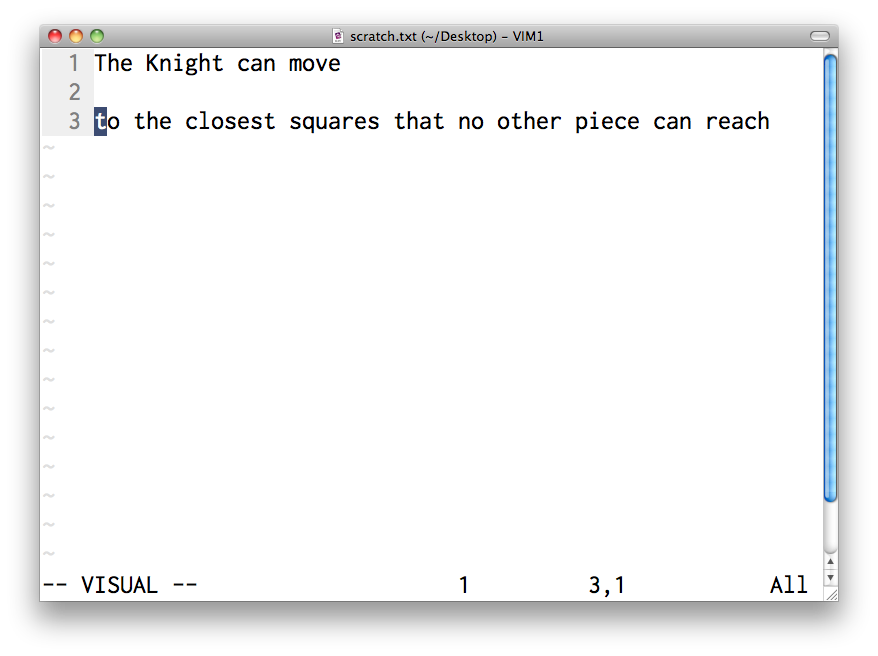
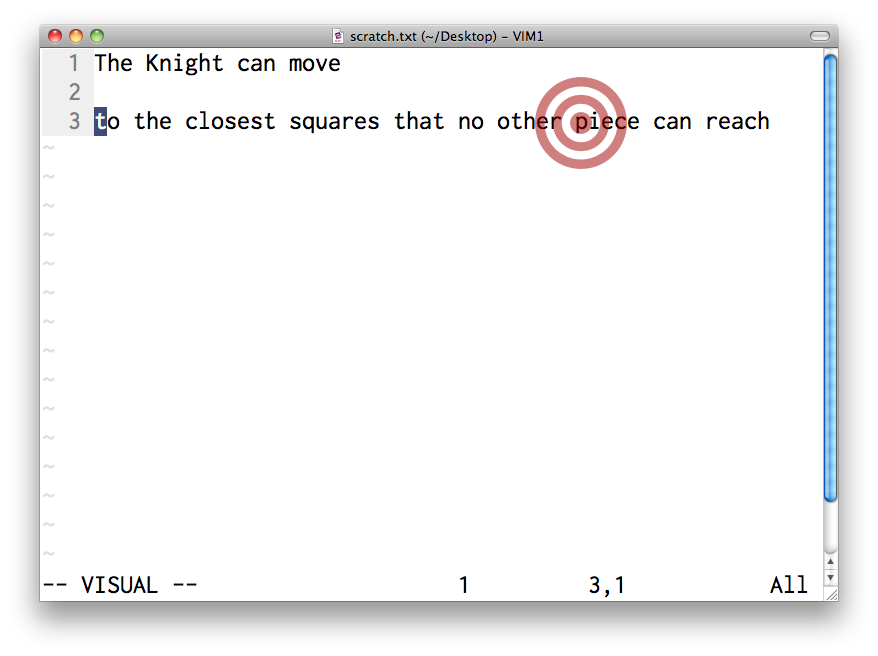
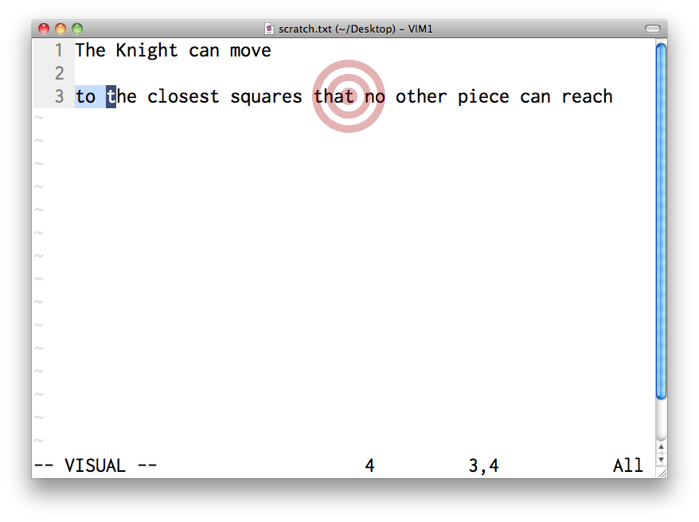
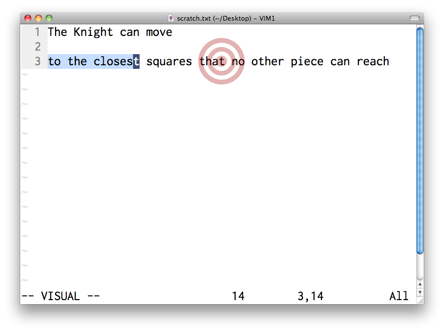
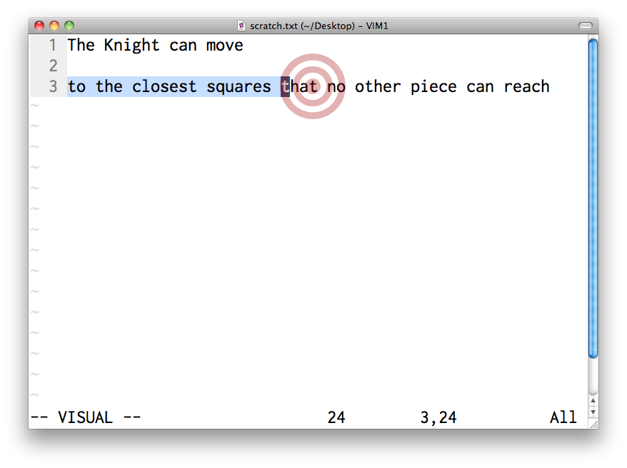

!SLIDE
# FINDING CHARACTERS

!SLIDE bullets
# FINDING CHARACTERS

* `f{char}` jumps to next occurence of `{char}`

!SLIDE center

!SLIDE center

!SLIDE

# `fp`

!SLIDE center

!SLIDE center

!SLIDE center

!SLIDE

# `ft`

!SLIDE center

!SLIDE

# `;`

!SLIDE center

!SLIDE center

!SLIDE center

!SLIDE

# `ft;;;`

!SLIDE bullets incremental

##THE VIM WAY

* do it (`f{char}`)
* repeat (`;`)
* reverse (`,`)

!SLIDE bullets

# Besides mindreading

* use with `d{motion}`
* use with `c{motion}`

!SLIDE bullets

# Inclusive or exclusive

* `f/F` land on the match
* `t/T` stop one short of the match

!SLIDE

### demo

!SLIDE bullets
# LIMITATIONS
## `f{char}` 

* only works
* on current line
* for single characters
